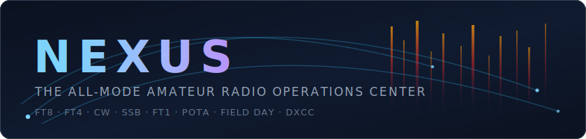

<div align="center">



**One app from antenna to award — FT8/FT4 digital, CW, and SSB phone in a single modern operations center.**

[](COPYING)

[](https://github.com/kd9taw/nexus/releases/latest)
[](https://github.com/kd9taw/nexus/releases)


[](https://github.com/kd9taw/nexus/releases/latest)
[](docs/manual/)

<sub>Offline installer — bundles WebView2 **and Hamlib**, per-user install, no admin rights. ·
**[Operator manual](docs/manual/)** · **[Comprehensive overview](docs/OVERVIEW.md)**</sub>

</div>

---

**Nexus** is a free, GPLv3, all-mode amateur radio operations center for the desktop. It puts a
WSJT-X-parity **FT8/FT4** cockpit, a **CW** keying station with an **AI decoder** (DeepCW model by e04), an **SSB phone** cockpit with a voice
keyer, a live **propagation map**, an evidence-backed **"work this now"** board, a **POTA/SOTA
hunter**, a club-ready **Field Day** mode, and a **DXCC-first logbook** with LoTW / QRZ / ClubLog /
eQSL connectors — in one window, on one rig, with one log.

It is built in **Rust** (DSP, sequencing, CAT, networking) behind a **Tauri** desktop shell, and it
treats **WSJT-X as the golden standard** for FT8/FT4 behavior: the auto-sequencer state machine,
decode cadence, split handling, Hound mode, and the UDP ecosystem protocol all match stock — your
WSJT-X muscle memory just works, inside a UI built this decade.

## Why Nexus

- **🎛️ All-mode, one app.** Digital, CW, and phone cockpits share one rig, one CAT layer, one
  logbook, and one needs engine. Entering a cockpit sets the rig up for it automatically — DATA
  submode for digital, CW for the keyer, the correct sideband by band for phone. No mode fumbling,
  no app-switching, no five stitched programs.
- **📡 WSJT-X operational parity in a modern shell.** The FT8/FT4 core replicates the stock
  behavior the whole ecosystem depends on: the QSO sequencer state table, the early decode pass at
  11.8 s, Split Operation (Rig / Fake It), Hound mode, directed CQ, the Tx1–Tx6 panel, the F-key
  shortcuts, and the full WSJT-X UDP protocol — JTAlert, GridTracker, and loggers see Nexus as a
  WSJT-X. A **Classic ↔ Roster** toggle gives you the stock layout or a modern sortable call roster.
- **🧭 An honest "work this now" board.** Every Needed row shows its evidence — *“heard by K9LC
  (EN52, 26 km), 4 min ago”* — and admission is gated by corroboration rules: multiple receivers
  near **you**, Es-patch locality on VHF, reciprocal-path checks. A superstation on a mountain
  can't tell you a band is open when it isn't open *at your QTH*. One click QSYs the rig, opens
  the right cockpit, and prefills the log — split offsets parsed from cluster comments included.
- **🏞️ POTA & SOTA hunting built in.** Live activator spots with **NEW PARK** and **BAND OPEN**
  badges, and a one-click **HUNT** that tunes the radio and pre-tags your next QSO with the park
  or summit reference in standard ADIF. Hunter-focused, zero bookkeeping.
- **🏕️ Field Day that runs the club.** ARRL FD and Winter FD event modes with correct scoring
  (per-mode points, dupes per band *per mode*, legal power tiers, live bonus checklist),
  submittable Cabrillo 3.0 — and every contact pushed in real time to the club's **N3FJP** master
  log over its official TCP API and broadcast as native **N1MM+** `<contactinfo>` datagrams.
  One laptop logs digital, CW, and phone into one dupe-checked event log.
- **🏆 A logbook that chases awards properly.** DXCC, DXCC Challenge, Honor Roll, WAS, and WAZ
  computed offline from your log, with source-aware confirmations (eQSL never silently counts
  toward LoTW-grade awards), two-pull incremental LoTW sync, a per-QSO upload state machine that
  survives restarts, callbook autofill, and a local-only **Journey** achievement layer that makes
  the first 100 QSOs as motivating as the last 10 entities.
- **🗺️ Propagation you can act on.** A live world map (3-D globe / azimuthal beam map / flat) fused
  from PSK Reporter, RBN/DX-cluster, and NOAA space weather; an opening detector anchored to *your*
  QTH with reciprocity gates and propagation-mode classification (Es / F2 / aurora / tropo); and a
  persistent **Now-Bar** answering “am I getting out?” from anywhere in the app.
- **🔌 Zero-config setup.** Plug in the radio and click **Detect my radio** — Nexus reads the USB
  descriptors, matches the rig model, pairs the audio CODEC, and links the one driver you need if
  it's missing. Hamlib ships inside the installer. A goal-driven first-run wizard (“what do you
  want to do?”) shapes the app to you, and your declared license class becomes a real Part 97
  transmit lockout — Nexus refuses to key outside your privileges, a software guard in every
  TX path.
- **💬 Novel weak-signal chat tiers.** The original Tempo layer: **FT1** (4-second conversational
  cycle) and **DX1** (fading-resilient non-coherent 8-FSK) with IR-HARQ retransmission combining
  and presence-gated store-and-forward — simulation-validated, seeking on-air reports.
- **🔌 Program your radios.** The **Program** section turns "load the local repeaters into my HT"
  from an evening with legacy per-radio software into minutes: pick a location (your grid, any
  grid, or a city for a trip), fetch the repeaters around it, ADD the ones you want, and export a
  **CHIRP-ready CSV** (CHIRP flashes ~1,000 radio models) or a plain CSV — offsets, tones, channel
  numbers, and radio-length names handled for you. With a CAT rig connected, one click **tunes the
  rig to a repeater now**, exact odd-split offsets included. Data courtesy of RepeaterBook.com
  (with your own API token) or the open hearham.com directory.

## Who it's for

**The new ham.** Nexus compresses the painful first month into an afternoon: auto rig detection
instead of driver archaeology, a wizard that asks what you want to *do* rather than what you know,
a license-class lockout so you can't transmit out of segment, an auto-sequencer that completes
FT8 QSOs while you learn the flow by watching, a Needed board that says *who* to work and *why*,
and a Journey layer that celebrates your firsts. You can be making contacts the day your callsign
hits the FCC database.

**The WSJT-X operator.** Same gestures, same flow: double-click semantics straight from
`processMessage`, Esc / F4 / F6 / Alt+1–6, Band Activity bottom-pinned in chronological order,
early decodes at 11.8 s, Fake-It split keeping TX audio in 1500–2000 Hz, Hound auto-move on the
Fox's report. Plus what stock never had: country and need annotations on every decode row, a
sortable roster view, in-app LoTW/QRZ sync, and always-on decode (no accidental deaf Monitor-off).

**The DX chaser.** ATNO / new-band / new-mode / new-zone ranking across **all** bands
simultaneously (not just the one you're tuned to), DXpedition tracking with workable-now cards,
cluster split comments (“UP 2”) parsed and applied to the rig at click time, Honor Roll math, and
confirmation diagnostics that explain exactly why a QSO isn't credited yet — with a one-click fix
where one exists.

**The club.** Field Day mode reshapes the app for the event weekend and feeds club infrastructure
natively — no JTAlert bridge, no end-of-day log merges. Plus a built-in CAT broker so other shack
software can share the radio *through* Nexus.

## Works with your shack

| Integration | What it does |
|---|---|
| **WSJT-X UDP protocol** | Full outbound Decode / Status / QsoLogged / Heartbeat + inbound HaltTx, Clear, Replay, Location, Highlight — JTAlert and GridTracker see a WSJT-X |
| **CAT broker** | Nexus serves a rigctld-compatible TCP port so WSJT-X, N1MM+, and loggers share the radio through it |
| **Companion mode** | Ride an upstream WSJT-X/JTDX decode stream over UDP instead of owning the rig |
| **N3FJP** | Real-time Field Day QSO push over the official TCP API, with a connection Test button |
| **N1MM+** | Native `<contactinfo>` UDP broadcast per contact |
| **LoTW** | TQSL upload + two-pull incremental confirmation sync |
| **QRZ.com** | Callbook autofill, logbook push, connection test |
| **ClubLog / eQSL** | Real-time push (official installers bundle the ClubLog API key; source builds supply their own free key) / InBox confirmation import |
| **DX cluster / RBN** | Telnet feed with locality-gated VHF admission |
| **PSK Reporter** | MQTT firehose in for propagation; standard UDP spot uploads out (you appear on the map) |

Credentials for every service live **only in the OS keychain** — never in config files, never in
logs, never shown back to the UI beyond “configured.”

## Quick start

1. **[Download the installer](https://github.com/kd9taw/nexus/releases/latest)** — Windows `.exe` or
   Linux `.AppImage`/`.deb`, offline, bundles WebView2 and Hamlib, per-user, no admin needed.
   (Also mirrored on [SourceForge](https://sourceforge.net/projects/nexus-ham-radio/files/).)
2. Plug in the radio, open **Settings ▸ Rig & Audio**, click **Detect my radio**.
3. Answer the first-run wizard: callsign, grid, license class, and what you want to do.
4. Watch decodes arrive. Double-click a station — the sequencer runs the QSO, and the contact
   lands in the logbook, on PSK Reporter, and (if configured) on QRZ and LoTW.

New here? Start with **[Getting Started](docs/manual/Getting-Started.md)**.

> The installer is **unsigned** (cross-compiled on Linux), so SmartScreen may warn — *More info →
> Run anyway*. Verify the download against the `SHA-256` published on the
> [GitHub release](https://github.com/kd9taw/nexus/releases/latest).

## Status — the honest version

- The **FT8/FT4 tier is the production core**: operational parity with stock WSJT-X, verified
  against a 207-row behavior matrix and exercised on the air daily.
- **CW and Phone cockpits** are casual/ragchew-grade by design: macros, voice keyer, scope, full
  logging — macros, voice keyer, live single-signal CW decoder, WinKeyer support, full
  logging — no contest exchanges yet.
- The **FT1/DX1 chat tiers are simulation-validated, not yet proven on the air** — AWGN and fading
  sweeps say they work; on-air decode-rate reports are the remaining gate and the single most
  useful contribution you can make.
- **Windows installer** is the supported package today; the codebase is cross-platform Rust/Tauri
  and builds on Linux.
- Not implemented (yet): Fox role (running a DXpedition end), contest modes (NA VHF / RTTY RU /
  WW Digi), WSPR-as-a-mode, Q65/MSK144.
  (Shipped since earlier revisions of this list: rotator control with satellite auto-track,
  the amateur-satellite section, 23 cm band support, per-QSO WAV save, HRDLog.net, a headphone
  monitor, and a native ITU-R P.533 propagation engine selectable beside the heuristic model.)

## Architecture

```
┌────────────────────────────────────────────────────────────────┐
│ Tauri v2 desktop shell (src-tauri) + web UI (ui/, React + TS)  │
│   cockpits: Operate · CW · Phone · Field Day · Connect map     │
│   boards: Needed · POTA/SOTA · Logbook · Awards · Journey      │
├────────────────────────────────────────────────────────────────┤
│ Rust core (crates/)                                            │
│   tempo-app    live TX/RX engine · settings · DTOs             │
│   tempo-core   slot timing · 77-bit messages · QSO sequencer · │
│                logbook/ADIF · Field Day · reconcile            │
│   tempo-audio  cpal audio · rigctld CAT · CW keyer · voice     │
│                keyer · decode scheduler · CAT broker           │
│   tempo-net    WSJT-X UDP · PSK Reporter · DX cluster ·        │
│                LoTW/QRZ/ClubLog/eQSL · N3FJP · N1MM            │
│   propagation  needs engine · opening detector · space wx ·    │
│                awards · Journey                                │
│   ft1/ft1-sys  safe wrapper + FFI over libft1                  │
├────────────────────────────────────────────────────────────────┤
│ libft1 (Fortran → C ABI, FFTW3, no Qt)                         │
│   FT8/FT4 encode+decode · FT1 4-CPM turbo + IR-HARQ ·          │
│   DX1 non-coherent 8-FSK + soft LDPC                           │
└────────────────────────────────────────────────────────────────┘
```

See **[docs/ARCHITECTURE.md](docs/ARCHITECTURE.md)** for the full design.

## Building from source

```bash
git clone https://git.code.sf.net/p/nexus-ham-radio/code nexus
cd nexus
cargo test --workspace                  # Rust core (modem FFI, engine, sequencer, exports)
cd ui && npm install && npx vitest run  # UI suites
# Windows installer, cross-compiled from Linux/WSL2:
./scripts/build-windows-cross.sh
```

The FT1/FT8 modem is Fortran + C behind a Rust FFI, so the **GNU toolchain** is required — see
**[Building from Source](docs/manual/Building-from-Source.md)** and [WINDOWS.md](WINDOWS.md).

## Documentation

- **[Comprehensive overview](docs/OVERVIEW.md)** — every surface, in depth
- **[Operator manual](docs/manual/)** — setup, per-mode operating guides, integrations, troubleshooting
- **[FT1 protocol specification](docs/FT1-Protocol.md)** — the native waveform, for implementers
- **[Frequency plan](docs/FREQUENCIES.md)** — where the FT1/DX1 tiers live on the bands

## License & credits

Nexus is **free software under the [GNU GPL v3](COPYING)** (GPL-3.0-only).

- **WSJT-X** — Joe Taylor **K1JT**, Steve Franke **K9AN**, Bill Somerville **G4WJS**, and the WSJT
  Development Group. Nexus's digital modem (`libft1/`) is **derived from WSJT-X**: the FT8/FT4 codec,
  the 77-bit message packing, the LDPC(174,91) FEC, and the CRC-14 check are their GPL-licensed work,
  vendored and reused unmodified via a foreign-function interface (see **[NOTICE](NOTICE)** for the
  full lineage and marked modifications). Nexus interoperates with their ecosystem over the standard
  WSJT-X UDP protocol; its auto-sequencer is original Rust modeled on WSJT-X's on-air behavior.
  **Nexus is not endorsed by nor affiliated with the WSJT Development Group.** GPLv3.
- **FT1 / DX1** — the native weak-signal waveforms by **KD9TAW**.
- **[Hamlib](https://hamlib.github.io/)** — bundled `rigctld` for CAT control (GPL/LGPL).
- **[FFTW](https://www.fftw.org/)** (GPL), **[Tauri](https://tauri.app/)**, React,
  [cpal](https://github.com/RustAudio/cpal), Natural Earth basemap (public domain).
- **[DeepCW](https://github.com/e04/deepcw-engine)** — the AI CW decoder model by **e04** (AGPL-3.0).
- Built with the help of **[Claude](https://www.anthropic.com/claude-code)** (Anthropic's AI coding
  assistant) as a pair-programming and review tool; all work directed and reviewed by the author.
  See **[NOTICE](NOTICE)** for the full attribution and license heritage.

This is **experimental amateur-radio software**. You are responsible for operating within your
license privileges and local regulations. Nexus never transmits on launch; ARRL Field Day
prohibits fully-automated contacts, and Nexus's Field Day workflow is operator-initiated by design.

**Author:** **KD9TAW** · kd9taw@protonmail.com ·
contributions welcome — see **[CONTRIBUTING.md](CONTRIBUTING.md)** and the
[Code of Conduct](CODE_OF_CONDUCT.md).

<div align="center"><sub>

**[⬇ Download](https://github.com/kd9taw/nexus/releases/latest)** ·
**[📖 Manual](docs/manual/)** ·
**[💬 Discussion group](https://groups.io/g/hamradiotools)** ·
**[🐛 Report a bug](https://github.com/kd9taw/nexus/issues)** ·
**[📦 SourceForge mirror](https://sourceforge.net/projects/nexus-ham-radio/)**

</sub></div>
